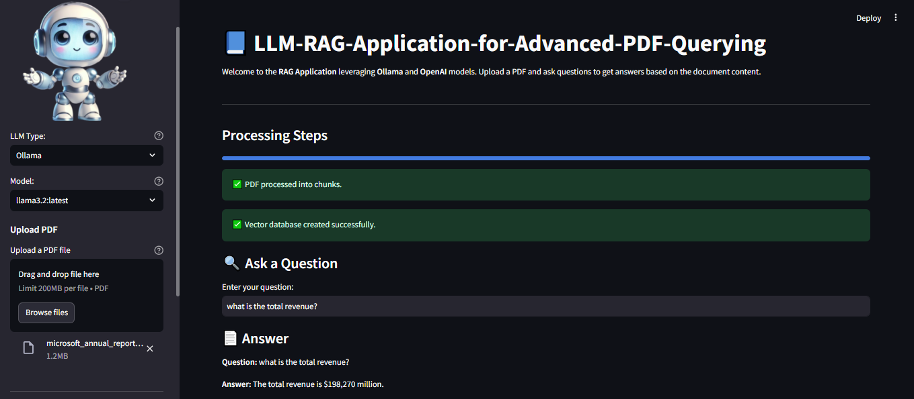
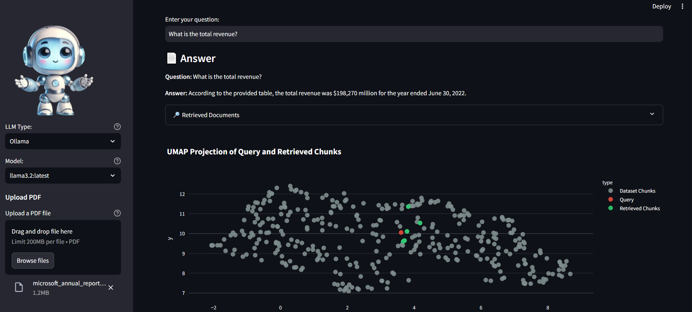

# Hybrid-LLM-RAG-Application-for-Advanced-PDF-Querying

---

## 📘 Overview

**Hybrid-LLM-RAG-Application-for-Advanced-PDF-Querying** is a powerful Retrieval-Augmented Generation (RAG) system designed to leverage **OpenAI** and **Ollama** language models for advanced querying of PDF documents. This application processes PDF files, generates embeddings, stores them in a vector database, and answers user queries based on document content using state-of-the-art language models.

---

## 🚀 Features

- [x] **Hybrid LLM Support:** Switch seamlessly between OpenAI and Ollama models.
- [x] **PDF Chunking and Querying:** Automatically processes PDF files into chunks for efficient retrieval.
- [x] **Dynamic OpenAI API Configuration:** Load API keys from a `.env` file or input them directly in the application.
- [x] **Interactive UI:** User-friendly interface built with Streamlit.
- [x] **Real-Time Progress Bar:** Displays step-by-step progress for processing, embedding, and querying.
- [x] **Customizable RAG Settings:** Easily configure the LLM type and model through a sidebar.
- [x] **Embedding Visualization:** Leverage UMAP to visually project query and retrieved embeddings in 2D space, with interactive tooltips displaying document chunks and query text.

---

## To-Do List: Upcoming Enhancements

### Planned Improvements:

- [ ] **Experiment with Advanced Embedding Models:** Incorporate other embedding models like Sentence-BERT, Cohere, or HuggingFace transformers for better semantic understanding.
- [ ] **Implement Smarter Chunking Techniques:** Explore methods such as semantic chunking or token-based chunking for more meaningful splits of document content.
- [ ] **Integrate Advanced Retrieval Strategies:** Add techniques like Multi-Query Retriever or hybrid approaches combining vector and traditional search methods.
- [ ] **Develop Agentic RAG:** Build agents to handle multi-step queries, retrieve additional data, or interact dynamically with APIs.
- [ ] **Enable Multilingual Document Support:** Extend the application to handle documents in languages like German, French, or Spanish for broader usability.

---